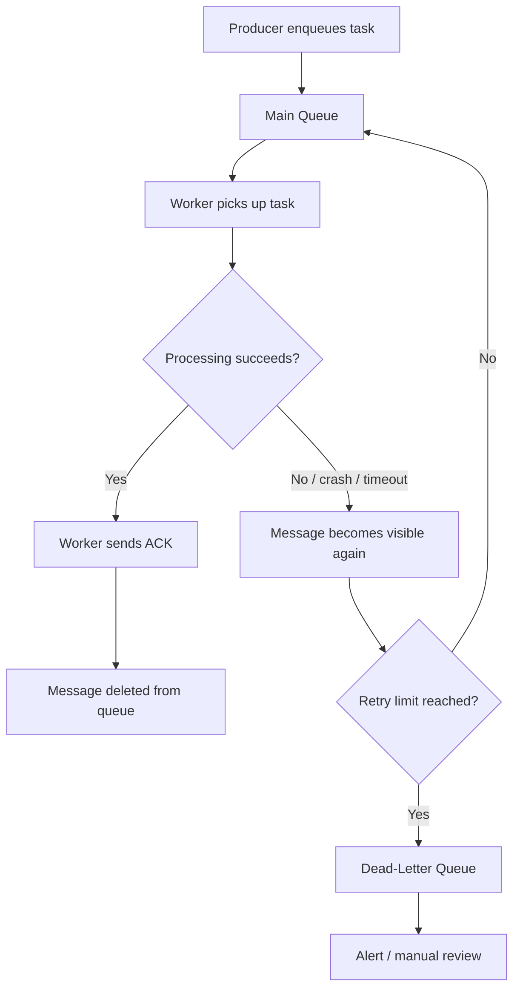

If you run AI workloads through a task queue, duplicates are not a bug. They are a feature of the delivery guarantee you almost certainly chose. Understanding why they happen, and designing for them, is the difference between a pipeline that wastes money on redundant LLM calls and one that shrugs off failures gracefully.

Think of it like a busy kitchen. A ticket printer spits out orders, and line cooks pull them. If a cook drops a plate halfway through and nobody crosses the ticket off, the expeditor calls it again. The kitchen makes the dish twice. That's at-least-once delivery: better to send an extra plate to the pass than to lose an order entirely.

## Why Exactly-Once Delivery Is So Rare

Most engineers want exactly-once delivery: every message processed one time, no more, no less. The problem is that exactly-once requires coordination between the broker and the worker that is extremely hard to achieve in practice. The broker needs to know the worker finished, and the worker needs to know the broker won't send the message again. In a distributed system where either side can crash, restart, or lose a network connection at any moment, that coordination breaks down.

What you actually get in most systems is one of two alternatives:

- **At-most-once**: the broker deletes the message before the worker confirms success. If the worker crashes, the message is gone. Simple, but you lose work.
- **At-least-once**: the broker keeps the message until the worker explicitly acknowledges it. If anything goes wrong, the message gets redelivered. You never lose work, but you get duplicates.

At-least-once is the default in SQS, Celery with `acks_late=True`, Google Cloud Tasks, and most durable workflow engines like Temporal. It's the pragmatic choice for pipelines where losing a task is worse than doing it twice.

## How Duplicates Actually Happen

Duplicates are not some theoretical edge case. Three scenarios produce them regularly:

**Worker crash mid-processing.** A worker picks up a message, starts an expensive OCR extraction, and gets OOM-killed halfway through. The broker never received an acknowledgment, so it redelivers the message to another worker. Now two attempts exist: one partial (dead), one fresh.

**Visibility timeout expiry.** In SQS, when a worker receives a message, that message becomes invisible to other consumers for a configurable window (the visibility timeout). If your AI pipeline task takes longer than expected—say a large PDF triggers a slow embedding model—the timeout expires and SQS hands the message to a second worker while the first is still running.

**Late acknowledgment.** The worker finishes the job and sends an ack, but the network blips. The broker assumes the worker failed and redelivers. The work was already done, but the queue doesn't know that.

All three scenarios result in the same task being executed more than once.

## Idempotency: Making Duplicates Harmless

Idempotency means that running an operation multiple times produces the same result as running it once. Back to the kitchen: if you've already plated the risotto and it's sitting under the heat lamp, you don't fire a second one just because the ticket printed again. You check the pass first. Same idea in code.

The most common pattern is an **idempotency key**—a unique identifier derived from the input that you check before doing expensive work:

```python
def process_document(task: dict):
    idempotency_key = f"doc:{task['document_id']}:v{task['version']}"

    if store.exists(idempotency_key):
        return  # Already processed, skip

    chunks = split_and_embed(task["content"])  # Expensive LLM call
    vector_db.upsert(task["document_id"], chunks)

    store.set(idempotency_key, ttl=86400)  # Mark as done
```

The key is derived from the document ID and version so that a legitimate re-processing (new version) still runs, but a duplicate delivery of the same version gets caught. The TTL on the key keeps your idempotency store from growing forever.

This is not clever. It's a few lines of code. But it's the difference between paying for one embedding call and paying for three because a worker got slow under load.

## The Redelivery Lifecycle

When you combine at-least-once delivery with retry policies and a dead-letter queue, message flow looks like this:



The dead-letter queue (DLQ) is not where messages go to die. It's a **throughput protection mechanism**. Without it, a poison message—a malformed PDF, an input that consistently crashes your OCR service—cycles through the queue forever, consuming worker capacity and blocking healthy tasks behind it. The DLQ catches these after a configured number of retries and moves them aside so the rest of the pipeline keeps flowing. You review them later, fix the root cause, and replay if needed.

Every kitchen has an 86 board—the list of items that are cut from service because you're out of an ingredient or a piece of equipment is down. You don't keep trying to plate a dish you can't finish. You pull it and deal with it. A DLQ is your 86 board for tasks that can't be completed right now.

## Why Retries Cost More in AI Pipelines

In a traditional web backend, retrying a database insert is cheap. In an AI pipeline, retries hit your wallet directly.

Consider a document ingestion pipeline: receive a PDF, OCR it, chunk it, generate embeddings, then extract structured fields with an LLM. If extraction fails and the task retries from the top, you're paying for OCR and embeddings again. At scale, this adds up:

- **Embedding generation**: a 50-page document might produce 200 chunks at ~500 tokens each. One unnecessary retry means 100,000 extra tokens through your embedding model.
- **LLM extraction**: a structured extraction call with a long context window can cost $0.05–$0.20 per call. Ten retries across a batch of 1,000 documents is an extra $500–$2,000.
- **Tool calls**: if your agent pipeline triggers external APIs (geocoding, enrichment, web search) on every retry, you're multiplying both cost and rate-limit pressure.

Idempotency keys at each stage let you skip work that already completed successfully. The OCR result is cached. The embeddings are already in the vector store. The retry only re-executes the extraction step that actually failed. This is sometimes called **partial progress recovery**, and it turns an expensive full retry into a cheap targeted one.

## Key Takeaways

- At-least-once delivery is the default in most task queue systems. Duplicates are expected, not exceptional.
- Idempotency keys are cheap to implement and directly reduce wasted LLM and embedding spend on retries.
- Dead-letter queues protect pipeline throughput by isolating poison messages instead of letting them loop forever.
- AI pipelines should cache intermediate results (OCR output, embeddings) so retries only redo the step that failed.
- Design your idempotency keys from the input data (document ID + version), not from internal state that might change between attempts.

## Further Reading

- [Amazon SQS Visibility Timeout](https://docs.aws.amazon.com/AWSSimpleQueueService/latest/SQSDeveloperGuide/sqs-visibility-timeout.html)
- [Amazon SQS Dead-Letter Queues](https://docs.aws.amazon.com/AWSSimpleQueueService/latest/SQSDeveloperGuide/sqs-dead-letter-queues.html)
- [Celery Task Acknowledgment and acks_late](https://docs.celeryq.dev/en/stable/userguide/tasks.html)
- [Temporal: Understanding Durable Execution](https://docs.temporal.io/evaluate/understanding-temporal)
- [Hatchet – Distributed Task Queue for Python](https://docs.hatchet.run/home)
- [Designing Data-Intensive Applications: Chapter 11 – Stream Processing (O'Reilly)](https://www.oreilly.com/library/view/designing-data-intensive-applications/9781491903063/ch11.html)
